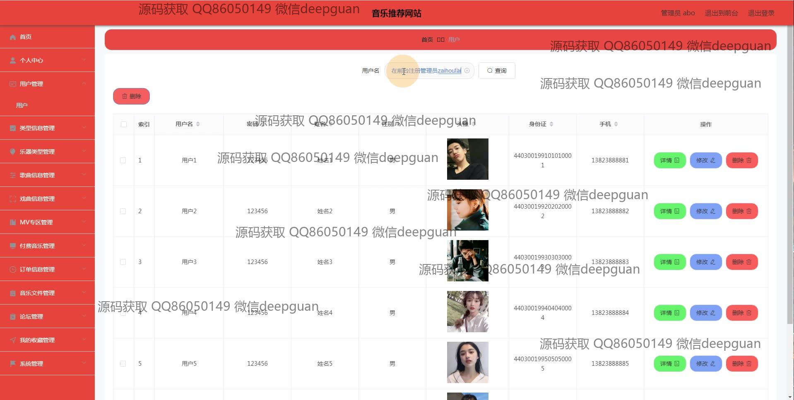
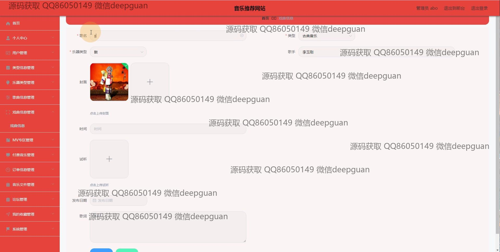
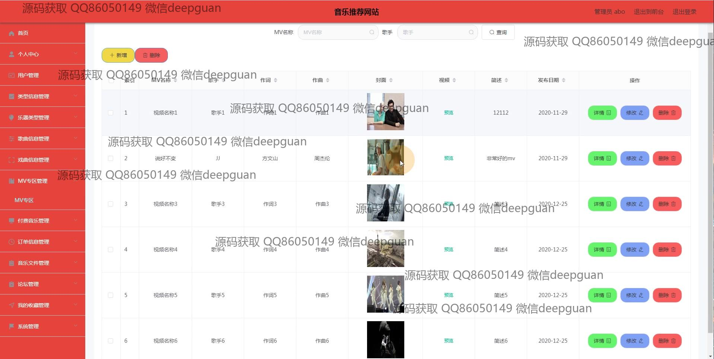

<h1 align="center">中国风音乐网站vue</h1>

## 简介
中国风音乐网站：角色分为管理员、用户；功能包括用户管理、歌曲与MV信息管理、专辑与订单管理、论坛互动、音乐分类与播放、用户注册登录等。    --计算机毕业设计源码；毕设源码；java毕业设计源码

## 联系方式

<h3 align="center">获取完整代码与数据库文件 + 微信：deepguan QQ: 86050149 QQ群: 783742310</h3>

<h3 align="center">可帮忙远程部署 包运行成功！提供远程部署、修改代码、设计文档指导、代码讲解等服务！</h3>

## 功能介绍（完整见运行截图）
管理员：基本功能包括登录、注册和退出。管理后台提供个人中心、用户管理、分类信息管理、歌曲信息管理、MV专区管理、订单信息管理等模块。管理员可以添加、编辑或删除歌曲、专辑和MV等信息，支持上传封面、音频和视频文件，以及管理用户收藏、论坛内容和订单详情。后台设计简洁直观，适用于数据的增删改查和日常维护。

用户：支持登录、注册和退出功能，进入网站后可以浏览首页内容，包括歌曲、MV专区、论坛信息和个人中心。用户可通过分类导航查看或搜索音乐，试听歌曲，查看专辑详情并参与评论互动。个人中心允许用户更新个人信息、修改密码、管理收藏以及查看订单信息，提升用户体验。

音乐管理员：负责维护歌曲、专辑和MV信息，支持输入乐器类型、发布日期、歌词等详细信息，提供封面和试听音频上传功能。还可以管理订单信息，查看用户收藏，确保音乐内容的完整性和分类准确性。

游客：无需登录即可浏览网站首页，查看音乐推荐、歌手信息和专辑展示，通过导航快速访问戏曲信息、MV专区及论坛页面，了解中国风音乐内容和网站特色。

## 运行截图

本代码来源于网络,仅供学习参考使用!

